# 为什么是七年？

七年这个概念有三个来源。

第一个来源是数字7本身的神奇，一周有7天，世界有7大洲，人眼所能够分辨的色彩有7种，人的工作记忆所能够记载的对象的数量为7，等等。

第二个来源是 @李笑来 的书籍《新生：七年就是一辈子》，李笑来老师的话要听，李笑来老师推荐的产品不要购买，书籍阅读地址为：[新生大学：七年就是一辈子](https://b.xinshengdaxue.com/)，一个短视频演讲可以在B站上观看：[七年就是一辈子](https://www.bilibili.com/video/BV19V411r7LF/?spm_id_from=333.337.search-card.all.click)。

第三个来源则是ITV的一个系列纪录片：人生七年。

通过观看这一系列的纪录片，能够起到“以人为镜可以明得失”的效果。

# 需要达到的目标

第一个七年需要打到的目标只有两个，按照优先级和重要级排序如下所示：

1. 成为一位数据科学家（data science）
2. 成为一位插画家（artist）

除了这两个目标之外，还需要学习一些额外的知识，用于拓展自己的语言能力，提高自己的心智和加深自己对于人类社会的认知。

这些额外的知识大致如下所示：

1. 锻炼自己的身体，让自己拥有两块胸肌和六块腹肌，同时掌握正念和高质量的睡眠的方法，身体是革命的本钱
2. 学习一些脑科学和认知心理学的知识，提高自己的心智认知的能力，从而达成事半功倍的效果
3. 提高自己的英语能力，打到雅思4个7分的水平，同时修正自己的口语和掌握学术写作的技巧
4. 如果有精力上的剩余，可以学习日语作为第二门外语

其他的就是一些娱乐的事情，没有必要特意罗列出来作为目标，就是日常生活的一部分好了。

# 提高自己的心智

## 健身

健身首先使用的视频资源为：卓叔增重。

通过这位UP主的视频来了解一些增重和健身的基础的知识。

接着是通过大师课来了解健身相关的知识：

最后是通过B站已经购买的健身课程：

来进行系统性的训练。

最终需要达到的目标是：锻炼出来两块胸肌和六块腹肌。

## 正念和睡眠

正念的学习视频有两个，第一个是HeadSpace：

第二个则是大师课：

睡眠相关的课程只需要观看：

就足够了。

## 认知

首先一定要看的是李笑来的《新生：七年就是一辈子》。

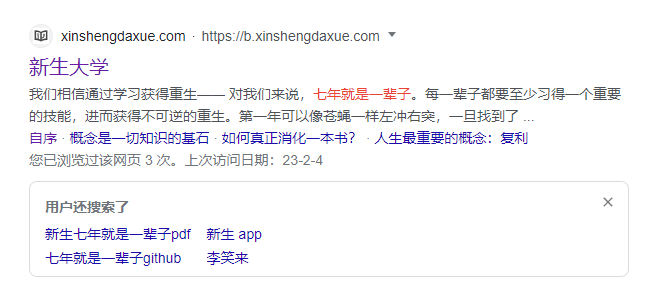

此外还有两个能够协助自己提高自己认知能力的教程。一个是Yjango的学习观：

另一个则是Yjango的断墨寻径：

还有就是要推荐达-瑞欧的《原则》：

## 脑科学

脑科学可以通过在B站上已经购买的两个课程来进行学习：

在学习对应的知识之后可以自己进一步的进行一些拓展性学习。

## 社会实践

首先需要推荐的是控制论相关的书籍：

接着是权力与政治相关的书籍：

和B站上的一个相关的视频：

经济学知识点：

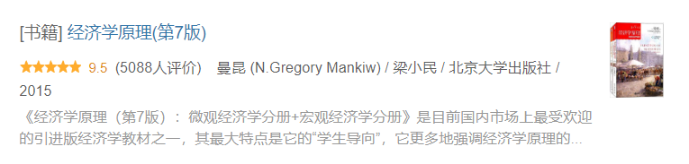

以及资本论：

中国社会逻辑：

人类学相关的书籍需要阅读《裸猿》三部曲：

还有崩溃：

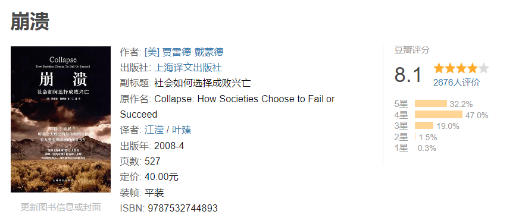

以及和两性相关的基本书籍：

和细读：

## 思想

哲学史：

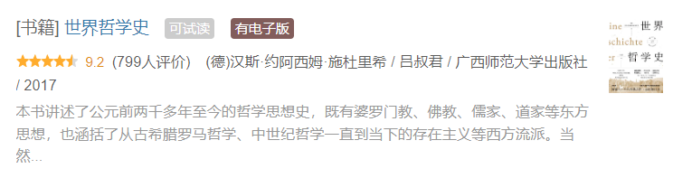

道德哲学：

## 屠龙之术（如果有时间）

首先是阅读党史：

接着是阅读毛选：

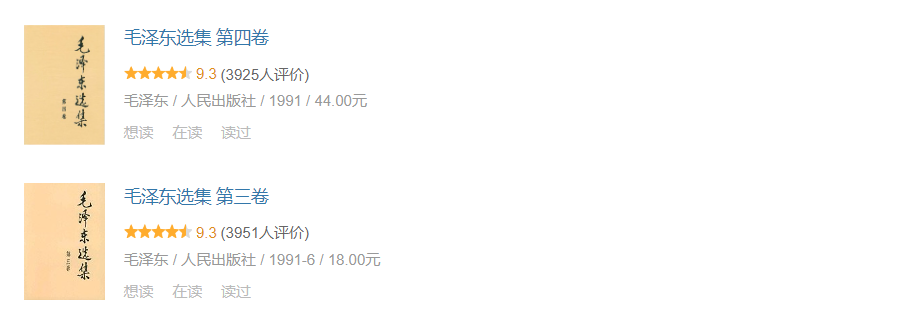

两套书进行对照阅读，从而了解不同时期的文章和思想对应的社会环境和社会问题是怎么样的。

# 成为一位数据科学家

关于如何成为一位数据科学家，之前发表过一篇文章：[数据科学家之路](https://yejiu97.github.io/2022/10/30/DataSciencePath/)。

由于有一些内容我已经完成，另外一些内容由于一些如人在国外，或者有着更好的资源等因素的影响，所以会进行修改。

## Python语言

成为一位数据科学家，必然的绕不开Python语言。

Python语言最好的教程是：《Python编程：从入门到实践》，但是这本书早在之前就已经完成了，所以这里需要另外一些Python相关的教程来完成对于Python语言的复习和加深对Python语言的理解。

首先是Udemy的Python语言教程：

通过这门课来完成对Python语言的语法相关的知识点的复习。

接着是使用Python语言来做一些习题来进行查漏补缺：

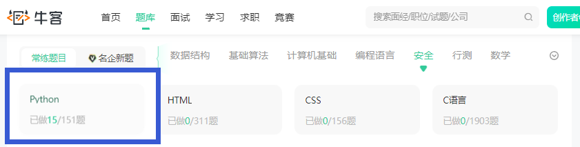

接着需要使用Python语言来实现一些项目，从而提高自己的工程实现能力：

还有就是：

这本书也偏向于工程，能够作为Python语言的语法使用的技巧性进阶的学习材料。

如果有兴趣，可以进行进一步的学习：

## R语言

数据科学另一门绕不开的编程语言则是R语言，R语言是专门为了统计学而设计出来的语言，而是数据科学中最常用的一门编程语言。

R语言学习采用的书籍则是：

使用的两门Udemy的教程视频则是：

## Java语言

接着是Java语言，Java语言是大数据相关领域被常用的语言。

Java语言会采用的学习教程是AcWing的Java语法课程：

之前在B站上购买的Java的教程也可以看一下：

接着还是做一些Java语言相关的习题：

接着是使用Spring和SpringBoot框架来使用Java实现项目：

## C++

C++并不是成为一位数据科学家所必学的课程，但是可以稍微学一下：

做一下习题：

## SQL

SQL所使用的两本书籍是：

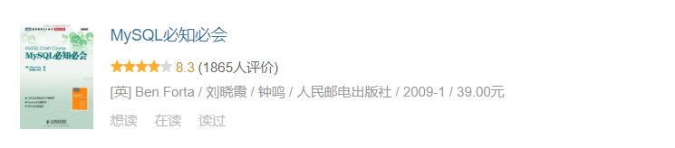

使用的视频教程是：

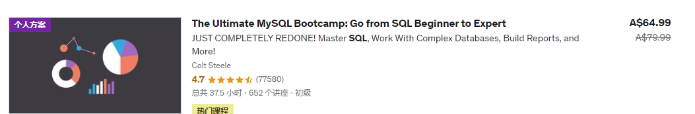

然后使用LIntCode和牛客网的习题来进行巩固：

另外LeetCode也提供了数据库相关的习题：

至此，数据科学中关于编程语言相关的全部完成。

## 数据结构与算法

数据结构与算法不一定是数据科学的一部分，但是一定是学计算机科学和面试的时候必不可少的一部分。

首先需要使用的是AcWIng的算法基础课：

另外可以阅读的书籍是：

Java语言的算法使用的书籍为：

使用C++来实现算法则会使用课程：

Python语言之前已经学了：

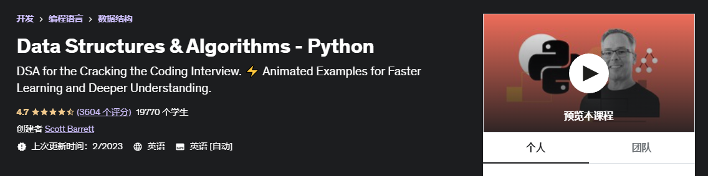

现在可以进一步的学习：

在进行求职面试之前，需要刷一些习题，可以使用：

以及完成这些题目：

## 数学

对于数据科学而言，数学基础是非常重要的。

首先看的是通识书籍：

接着是微积分的内容：

从一个更直观的角度来看待微积分：

然后是线性代数：

书籍为：

从一个更加直观的角度来看待线性代数：

接着是统计学：

统计学另外可以使用这个教程：

这个教程中还会使用Excel来进行分析。

概率论则使用：

概率统计的一个教程为：

另外还可以使用一门更加针对性的课程：

## 数据分析

数据分析首先可以看的书籍是：

通过这本书可以对数据分析有着一个较为笼统的概括性的认知。

接着是学习B站上已经购买了的课程：

接着是Coursera提供的公开课：

接着是这本书：

以及专门讲关于Pandas的一本书籍：

还有就是Udemy的这门课程：

接着是牛客网提供的数据分析相关的习题：

与R语言相关的数据分析可以查看R语言部分，R本身就是被用来做这个的，所以在学习R语言的时候，自然而然的也会学到相关的内容。

## 数据科学

首先是R语言数据科学书籍：

接着是Udemy的几门关于Python数据科学的书籍：

涉及到机器学习相关的课程：

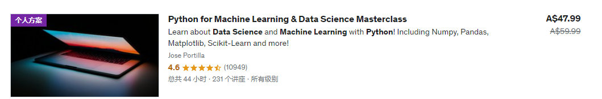

这里也可以使用李沐或者吴恩达的教程：

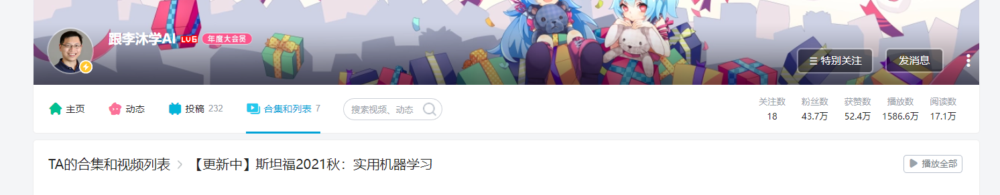

学完之后一定要自己动手在项目上进行实践，首先是 a collection of data science take home challenges：

然后是:

以及：

另外还有一些Kaggle的项目：

- [十个Kaggle项目带你入门数据分析](https://zhuanlan.zhihu.com/p/116665347)
- [2022年最值得推荐的20个 Kaggle 机器学习项目](https://chirpset.com/t/topic/299)

## 大数据

大数据相关首先需要学会使用Linux系统。

Linux指令相关采用的教程是：

学完之后采用LintCode提供的Linux习题：

Linux工程课则是使用AcWing的Linux课程：

在学习Vim课程的时候可以使用：

来辅助学习。

系统性的学习则采用Udemy的课程：

接着需要学习的是Spark使用的教程为：

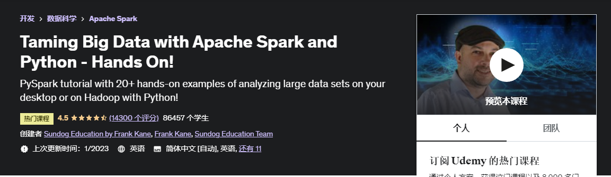

Hadoop则使用教程为：

LintCode提供了大数据相关的习题：

不过只有7道题目，只能够说聊胜于无。

# 成为一位插画家

## 艺术理论

首先是艺术史书籍：

以及现代艺术：

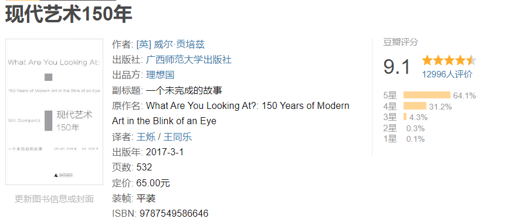

接着是在B站上购买的：

## 基础公开课

首先需要使用的一个较为系统性的课程是：

还有就是Krenz的公开课：

## 基础

基础课程需要使用的是：

1. Krenz透视
2. Krenz色彩
3. Krenz构成

以及文艺复星球的：色彩造型基础班。

基础还有一本书是：

## 进阶

准备使用柯一正的IE-Art来进行进阶：

进阶的书籍则是：

## 终极

应该会选择阮佳的课程：

也有可能是Victor-Cloux的课程。

## 其他

这是一些会辅助提高自己的作品的学习内容。

首先是关于电影的：

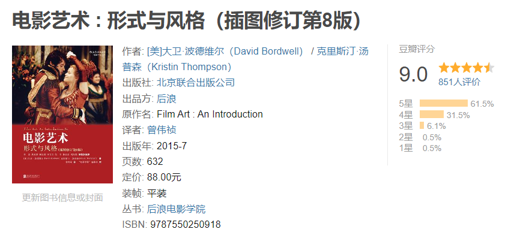

还有就是大师镜头系列：

# 语言

## 单词

单词使用的单词书有两本：

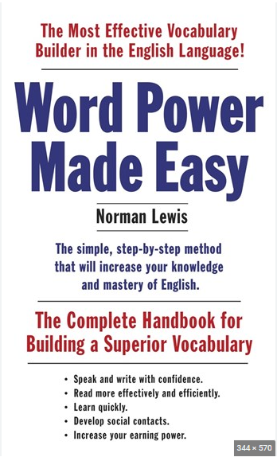

和

配合使用的Udemy的课程是：

## 语法

除了单词之外，还需要理解英语的语法。

语法使用的是B站上的一个英语语法课程：

配合使用的Udemy的语法课程为：

## 听力与口语

口语课程首先可以使用的是B站的口语课程：

口音纠正则使用：

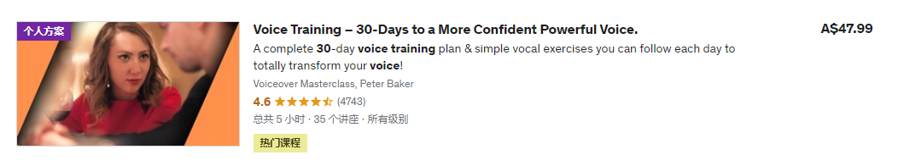

还有就是：

## 写作

写作采用的是：

## 雅思备考

首先使用的是Udemy的课程：

接着需要使用的是雅思官方的习题集：

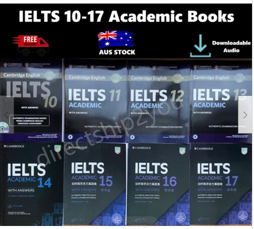

写作会采用顾家北的书籍：

和慎小嶷的书籍：

还有就是使用一些软件来辅助自己学习：

# Web

如果上面的内容已经完成或者还有余力，则会学习一些Web相关的内容。

## HTML 和 CSS

HTML+CSS的课程看这一门课就完事了：

另外需要使用LintCode的习题：

和牛客网的习题：

来完成知识点的巩固。

## JavaScript 和 Vue

JavaScript则采用Udemy的课程：

和：

同样的，还有做习题：

接着是学习一下Vue这个框架：

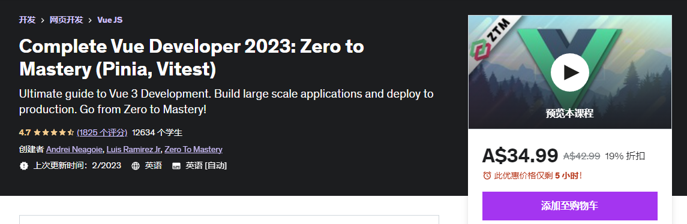

## Django

Django首先使用的是AcWing的课程：

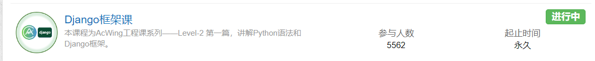

还有就是Udemy的课程：

## Web课程

首先使用的是AcWing的Web工程课程：

使用的项目Udemy的课程为：

还有就是：

和：

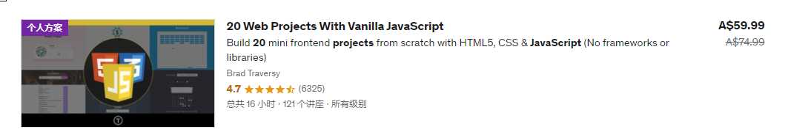

# 娱乐

## 纪录片

纪录片首先必看的是 人生七年系列：

此外，可以看一下这个集合中的纪录片的内容：

## 电影

电影可以看一下豆瓣TOP 250中的感兴趣的电影，另外可以看一下每年推荐的电影。

必看的电影有：

## 动漫

动漫也可以看一下每年热点动漫，但是也需要看一下一些经典的动漫。

必看的动画有：

进击的巨人整个系列。

JoJo系列：

还有就是鬼灭之刃系列动画。其他的每年年初的时候指定计划来进行观看。

漫画则是阅读进击的巨人和烙印战士等漫画：

此外还有一些别的经典的漫画也需要观看。

## 小说

首先要阅读的推理小说是：

接着是阅读“京极堂”系列：

仙侠必读的是诛仙：

科幻必读的是三体系列（复习）：

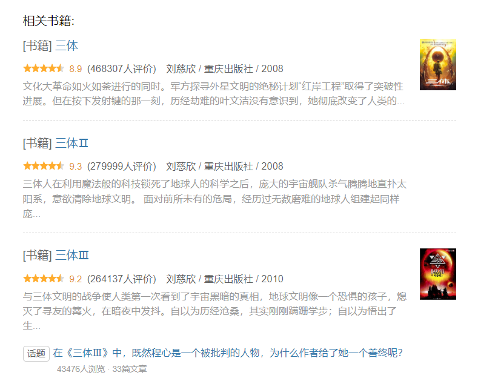

和来自新世界：

轻小说必读的书籍为狼與辛香料系列：

## 游戏

游戏必玩的是艾尔登法环：

血污-夜之仪式：

女神异闻录，P5R：

鬼泣5：

Lies of P：

编程游戏：

还有就是塞尔达传说-荒野之息：

和塞尔达传说-王国之泪：

在2024年能够发布的ACT动作类游戏，黑神话-悟空：

平台跳跃游戏为：

Galgame则是玩君与彼女与彼女之恋：

